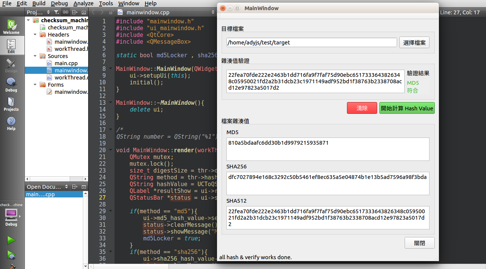
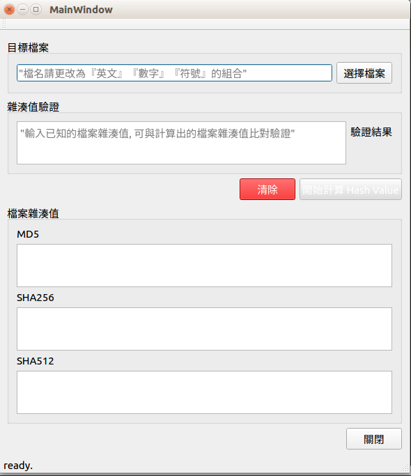
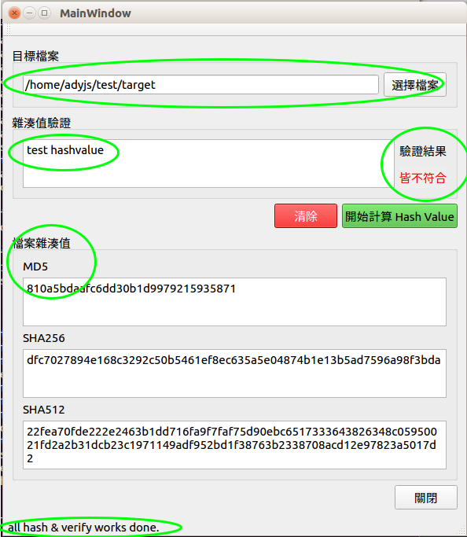

# Qt checksum machine

Qt 版本-雜湊驗證碼產生器

這個 checksum machine 應用程式是我的學習 Linux Programming 的一個小練習作品，
是學習「C 語言」、「Linux 作業系統」、「多執行序」，的過程中所延伸出來的東西，

製作想法是以前用過一個小程式叫做「MD5 & SHA Checksum Utility」，用法很簡單明瞭，
因此想要自己在 linux 上做一個類似的程式，作為學習的目標，

先在 Linux Ubuntu 上面使用 C 跟 pthread 配合 OpenSSL，
寫出一個可以從 cli 輸入檔案名稱的 checksum machine 之後，接著想著如何把它做成日常看到的 GUI 桌面程式。

在研究了 GTK+ 跟 Qt 之後，決定使用 Qt，
因此就接著學習 Qt 及 C++ 基礎語法，並把 C 語言版本的 porting 到 Qt 上，
把 pthread 改成 Qthread，配合 signal 及 slot 的語法，連接 UI 及後端邏輯，
最後的成果就是這個小程式了。

首先選擇你要驗證的檔案，檔名請保持『英文』『數字』『符號』的組合，

因為目前程式的限制，所以如果是『中文或其他語系』的檔名可能會造成程式無預期的關閉，

接著可以輸入已知的檔案雜湊值，
當按下 Hash 按鈕時，等到檔案雜湊值計算出來之後，就會自動比對驗證雜湊值，

完成之後可以直接選取別的檔案，或者按清除按鈕之後再重新操作。

